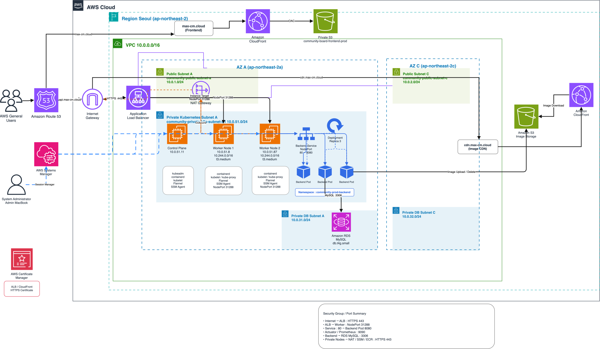
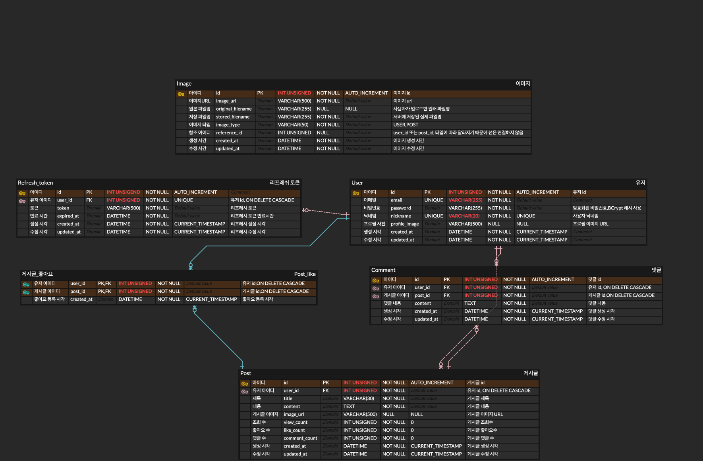

# Community

Spring Boot 기반으로 개발한 **커뮤니티 서비스**입니다.

회원 인증을 기반으로 게시글 작성·조회·수정·삭제, 댓글, 좋아요, 이미지 업로드 등의 기능을 구현했으며, 단순한 CRUD 애플리케이션 구현에서 끝내지 않고 **실제 서비스 운영 환경을 가정하여 배포, 모니터링, 성능 검증까지 단계적으로 확장**

Backend는 **Spring Boot 3, Java 21, JPA, QueryDSL, MySQL 8**을 기반으로 개발
인증은 JWT를 사용하며, **Access Token은 Authorization Header**, **Refresh Token은 HttpOnly Cookie와 DB**를 이용해 관리하도록 구성

Frontend는 HTML, CSS, JavaScript 기반의 정적 웹 애플리케이션으로 구현

초기에는 Frontend와 Backend를 EC2 기반으로 운영했지만, 프로젝트를 발전시키면서 각 워크로드의 특성과 운영 효율을 고려하여 인프라 구조를 개선

* Frontend는 **Private S3 + CloudFront** 기반의 정적 콘텐츠 제공 구조로 전환
* Backend는 **kubeadm 기반 Kubernetes** 환경으로 전환
* Helm과 Argo CD를 이용한 **GitOps 배포 환경** 구축
* Prometheus, Grafana, Loki를 이용한 **Metric 및 Log 모니터링 환경** 구축
* RDS 및 애플리케이션 Metric을 기반으로 한 **병목 분석 및 인프라 개선**
* 실제 사용자 행동을 모델링한 **Capacity Planning 및 부하 테스트**
* 동시 요청에서 발생한 **DB Deadlock 분석 및 Transaction 개선**
* HikariCP Connection Pool에 대한 **성능·안정성·자원 효율 비교 및 튜닝**

이를 통해 애플리케이션 기능 구현부터 AWS 인프라, Kubernetes 운영, CI/CD, Observability, 데이터베이스 동시성 문제와 성능 최적화까지 **서비스 개발과 운영의 전체 흐름을 경험하는 것**을 목표로 진행

---
## 시연 영상

프로젝트의 주요 기능과 운영 환경을 확인할 수 있는 시연 영상입니다.

▶️ [Community 프로젝트 시연 영상 보기](https://drive.google.com/file/d/1YpNn_pcC4WPLluA23yn35s3_ev2a0T3X/view?usp=sharing)

---

## 서비스 규모 및 트래픽 시나리오

실제 운영 사용자 수를 의미하는 값이 아니라, 서비스의 Capacity Planning과 성능 검증을 위해 **MAU 100만 규모를 목표 시나리오로 가정**했다.

| 항목 | 가정 |
| --- | ---: |
| MAU | 1,000,000 |
| DAU / MAU | 20% |
| DAU | 200,000 |
| 사용자당 일평균 세션 | 1.5 |
| 일평균 세션 | 300,000 |
| 피크 1시간 집중 비율 | 20% |
| 피크 1시간 세션 | 60,000 |
| 지속 피크 세션 유입 | 약 16.67 sessions/s |
| 순간 피크 세션 유입 | 약 33.33 sessions/s |

사용자는 모두 로그인 상태를 전제로 하고, 이용 패턴을 다음과 같이 구분했다.

- 조회 중심 사용자: 80%
- 댓글·좋아요 등 반응형 사용자: 18%
- 게시글 작성 사용자: 2%

사용자 유형별 행동을 기준으로 한 세션당 평균 API 호출 수는 약 `15회`로 계산했다.

이를 기준으로 Backend가 처리해야 할 목표 트래픽을 다음과 같이 설정했다.

- **지속 피크:** 약 `251 RPS`
- **순간 피크:** 약 `502 RPS`

커뮤니티 서비스 특성상 일반적인 피크뿐 아니라 경기 득점이나 종료 직후처럼 사용자의 조회·댓글·좋아요가 짧은 시간에 집중되는 상황을 고려해, 순간 피크를 지속 피크의 약 2배로 가정했다.

> MAU 100만은 실제 사용자 실측치가 아니라 **성능 검증을 위한 목표 서비스 규모**다.

---
## 주요 기능

| 구분  | 주요 기능                     | 설명                                                                |
| --- | ------------------------- | ----------------------------------------------------------------- |
| 인증  | 로그인 / 토큰 재발급              | JWT 기반 인증을 사용하며 Access Token과 Refresh Token을 분리하여 관리              |
| 인증  | Access / Refresh Token 관리 | Access Token은 Authorization Header로 전달하고, Refresh Token은 HttpOnly Cookie와 DB를 이용해 관리 |
| 회원  | 사용자 정보 조회                 | 로그인한 사용자의 정보를 조회하고 서비스 이용에 필요한 회원 정보를 관리                          |
| 게시글 | 게시글 작성                    | 로그인 사용자가 새로운 게시글을 작성                                              |
| 게시글 | 게시글 목록 / 상세 조회            | 게시글 목록과 개별 게시글의 상세 내용을 조회                                 |
| 게시글 | 게시글 수정 / 삭제               | 작성자가 자신의 게시글을 수정하거나 삭제                                    |
| 댓글  | 댓글 조회 / 작성                | 게시글의 댓글 목록을 조회하고 새로운 댓글을 작성                               |
| 댓글  | 댓글 수정 / 삭제                | 작성자가 자신의 댓글을 수정하거나 삭제                                     |
| 좋아요 | 게시글 좋아요                   | 사용자가 게시글에 좋아요를 등록하거나 취소                                  |
| 이미지 | 게시글 이미지 업로드               | 게시글 작성에 사용할 이미지를 업로드하고 관리                                    |
| 이미지 | 프로필 이미지                   | 사용자 프로필에 사용할 이미지를 관리                                         |

### 주요 특징

* 모든 서비스 기능은 **로그인 사용자를 기준**으로 동작한다
* JWT 기반으로 인증 상태를 관리하며 **Access Token과 Refresh Token의 역할을 분리**하였다.
* 게시글, 댓글, 좋아요 등 커뮤니티의 핵심 기능을 REST API로 구현
* 게시글 및 사용자 이미지는 애플리케이션과 분리하여 저장하고 제공할 수 있도록 구성

---
## 기술 스택

| 영역                        | 기술                                     |
| ------------------------- | -------------------------------------- |
| Backend                   | Java 21, Spring Boot 3, JPA, QueryDSL  |
| Database                  | MySQL 8, Amazon RDS                    |
| Frontend                  | HTML, CSS, JavaScript                  |
| Infrastructure            | AWS EC2, S3, CloudFront, ALB, Route 53 |
| Container & Orchestration | Docker, Kubernetes, Helm               |
| CI/CD & GitOps            | GitHub Actions, Amazon ECR, Argo CD    |
| Monitoring                | Prometheus, Grafana, Loki              |
| Performance Test          | k6                                     |

---
## Architecture

현재 서비스는 정적 Frontend와 Backend API를 분리하여 운영

- **Frontend**: Route 53 → CloudFront → OAC → Private S3
- **Backend**: Route 53 → ALB → Worker NodePort → Kubernetes Service → Backend Pod
- **Database**: Amazon RDS MySQL
- **Image**: Amazon S3 + CloudFront
- Kubernetes Node는 Private Subnet에 배치하고 AWS Systems Manager를 통해 관리



> [Architecture 원본 파일 (.drawio)](./docs/architecture/community-architecture.drawio)

---
## DB ERD

서비스 데이터는 사용자, 게시글, 댓글, 좋아요, 이미지, Refresh Token을 중심으로 구성

- `User`를 기준으로 게시글, 댓글, 좋아요, Refresh Token 관계를 구성
- `PostLike`는 사용자와 게시글의 좋아요 관계를 관리
- `Post`는 조회수, 좋아요 수, 댓글 수를 별도 컬럼으로 관리
- `Image`는 `image_type`과 `reference_id`를 이용해 사용자 이미지와 게시글 이미지를 구분



---
## 고민한 점

<details>
<summary><b>Flannel 기반 Kubernetes 환경에서 ALB 연동 방식 결정</b></summary>

<br>

### 배경

Backend를 kubeadm 기반 Kubernetes 환경으로 전환한 이후에도 외부 트래픽의 진입점으로 AWS Application Load Balancer를 사용했다.

이 과정에서 ALB가 Kubernetes Backend까지 트래픽을 전달하는 방식을 결정해야 했다.

AWS Load Balancer Controller에서 사용할 수 있는 Target Type은 크게 다음 두 가지를 검토했다.

- `ip`: Pod IP를 ALB Target으로 직접 등록
- `instance`: Worker Node를 ALB Target으로 등록하고 NodePort를 통해 Pod로 전달

### 검토

현재 Kubernetes Cluster의 CNI로 **Flannel(VXLAN)** 을 사용했다.

Pod는 VPC 대역의 IP를 직접 할당받는 구조가 아니라 별도의 Pod Network인 `10.244.0.0/16`을 사용했다.

따라서 ALB가 Pod IP를 직접 Target으로 관리하는 `ip` 방식보다, VPC 내부의 Worker Node를 Target으로 등록한 뒤 Kubernetes Service를 통해 Pod까지 요청을 전달하는 `instance` 방식이 현재 네트워크 구조에 더 적합하다고 판단했다.

### 해결 방법

ALB의 Target Type을 `instance`로 설정하고 Backend Service를 NodePort 방식으로 구성했다.

```text
Route 53
    ↓
Internet-facing ALB
    ↓
Worker Node :31288
    ↓
Kubernetes Service
    ↓
Backend Pod :8080
```

Service의 포트는 다음과 같이 구성했다.

```text
NodePort 31288
      ↓
Service Port 80
      ↓
Target Port 8080
      ↓
Backend Pod
```

ALB에는 Worker Node를 Target으로 등록하고 `31288` 포트로 요청을 전달하도록 구성

Worker Node로 전달된 요청은 Kubernetes Service를 통해 Ready 상태의 Backend Pod로 분산되도록 했다.

### 선택 이유

`instance` 방식을 사용하면서 기존 Flannel 네트워크 구조를 변경하지 않고 AWS ALB를 Kubernetes와 연동할 수 있었다.

또한 Pod가 재생성되어 IP가 변경되더라도 ALB가 개별 Pod IP를 직접 관리할 필요가 없고, 실제 Pod 선택과 트래픽 분산은 Kubernetes Service에 맡길 수 있었다.

최종적으로 현재 환경에서는 다음 구조를 사용했다.

> **ALB → Worker NodePort → Kubernetes Service → Backend Pod**

Target Type은 특정 방식에 대한 선호가 아니라 **현재 Cluster의 CNI와 Pod Network 구조를 기준으로 결정했다.**

</details>

<details>
<summary><b>HikariCP Connection Pool Size 최적화</b></summary>

<br>

### 배경

Backend는 3개의 Pod로 운영하고 있으며, 각 Pod가 HikariCP Connection Pool을 통해 RDS MySQL Connection을 사용한다.

초기에는 충분한 Connection을 확보하기 위해 비교적 큰 Pool Size를 사용했지만, Connection Pool은 크게 설정할수록 성능이 좋아지는 값이 아니었다.

Pool이 너무 작으면 요청이 Connection을 기다리면서 `Pending`과 응답 지연이 발생할 수 있고, 반대로 필요 이상으로 크게 설정하면 실제로 사용하지 않는 DB Connection을 확보하거나 DB에 불필요한 동시성을 허용할 수 있다.

따라서 단순히 가장 큰 Pool Size를 사용하는 것이 아니라 **목표 트래픽을 안정적으로 처리하면서 DB Connection을 과도하게 사용하지 않는 적정값**을 찾고자 했다.

### 목표 부하

임의의 RPS를 기준으로 설정값을 결정하지 않고 실제 사용자 규모와 행동을 기반으로 목표 트래픽을 계산했다.

- MAU: `1,000,000`
- DAU: `200,000`
- 하루 예상 세션: `300,000`
- 지속 피크: 약 `16.67 sessions/s`
- 순간 피크: 약 `33.33 sessions/s`
- 세션당 평균 API 호출: 약 `15회`

이를 기준으로 다음 부하를 검증 대상으로 설정했다.

| 구분 | 목표 트래픽 |
| --- | ---: |
| 지속 피크 | 약 251 RPS |
| 순간 피크 | 약 502 RPS |

테스트는 단일 조회 API를 반복하는 방식이 아니라 게시글 조회, 댓글 조회, 좋아요, 댓글 작성, 게시글 작성 및 이미지 업로드 등이 포함된 **실제 사용자 세션 기반 Open Model**로 진행했다.

### 검증 방법

Backend Pod 수는 `3개`, RDS는 `db.t4g.small`로 고정한 상태에서 Pod별 `maximumPoolSize`만 변경했다.

각 Pool Size마다 동일한 사용자 시나리오와 동일한 초기 데이터 상태를 사용하고 다음 지표를 비교했다.

- HTTP 실패 여부
- Dropped Iteration
- HTTP P95 / P99
- HikariCP Active Connection
- HikariCP Pending
- Connection Timeout
- Connection Acquisition Time
- Connection Usage Time
- 사용자 세션 수행 시간

### Clean Test 결과

| Pool Size | 전체 최대 Connection | k6 P95 | k6 P99 | Pending | Timeout | 주요 결과 |
| ---: | ---: | ---: | ---: | ---: | ---: | --- |
| 3 / Pod | 9 | 118.21ms | 319.33ms | 최대 2 | 0 | 처리 성공, Connection 대기 발생 |
| 4 / Pod | 12 | 406.21ms | 1.73s | 최대 2 | 0 | 처리 성공, 모든 Pod가 최대 Active 도달 |
| **5 / Pod** | **15** | **83.6ms** | **179.68ms** | **0** | **0** | 안정적으로 목표 부하 처리 |
| 7 / Pod | 21 | 64.66ms | 137.77ms | 0 | 0 | 일부 지연 개선, Connection 증가 대비 이득 제한적 |

### Pool 5 / Pod 결과

`maximumPoolSize=5`에서는 지속 피크 약 `251 RPS`와 순간 피크 약 `502 RPS`를 모두 안정적으로 처리했다.

- HTTP 실패: `0`
- Dropped Iteration: `0`
- Session Success: `100%`
- Hikari Pending: `0`
- Hikari Timeout: `0`
- HTTP P95: 약 `83.6ms`
- HTTP P99: 약 `179.68ms`
- 세션 평균: 약 `14.19초`
- 세션 P95: 약 `17.01초`
- Pod별 Active 최대: 약 `3 / 2 / 3`
- Connection 획득시간 최대: 약 `2.3ms`
- Connection 사용시간: 약 `5~9ms`

Pool의 최대 Connection은 전체 `15개`였지만 실제 정상 부하에서는 각 Pod가 지속적으로 5개의 Connection을 모두 사용하는 것이 아니라 대부분 `2~3개` 수준을 사용했다.

남은 Connection은 요청이 순간적으로 한 Pod에 집중되거나 SQL 처리시간에 편차가 발생하는 상황을 흡수하는 여유로 동작했다.

### 결정

Pool 3과 Pool 4에서도 요청 자체는 모두 처리했지만 순간적인 `Pending`과 Connection 획득 지연이 발생했다.

반면 Pool 5부터는 목표 부하에서 `Pending`과 `Timeout`이 발생하지 않았고 안정적인 응답시간을 유지했다.

Pool 7에서는 P95/P99가 일부 개선됐지만 Pool 5와 비교하면 전체 최대 Connection이 `15개 → 21개`로 약 40% 증가했다. 이에 비해 사용자 세션 수행시간과 전체 처리 성능의 개선 폭은 크지 않았다.

따라서 현재 운영 환경에서는 다음 값을 사용하기로 결정했다.

> **HikariCP maximumPoolSize = 5 / Pod**
>
> Backend Pod 3개 기준 전체 최대 Connection = **15개**

가장 작은 Pool Size나 가장 높은 Benchmark 성능을 선택하는 것이 아니라, **목표 트래픽을 안정적으로 처리하면서 성능·안정성·DB Connection 사용량의 균형을 만족하는 지점**을 운영 설정값으로 선택했다.

향후 파드 장애나 롤링 업데이트 중에 파드가 하나 없어질 때를 대비한 풀 사이즈를 측정하고, 톰캣 스레드도 최적화를 해볼 계획이다.

</details>

<details>
<summary><b>게시글 조회수 증가로 발생하는 DB Write 부하 개선</b></summary>

<br>

### 배경

게시글 상세 조회가 발생할 때마다 `view_count`를 즉시 증가시키는 방식으로 조회수를 관리하고 있었다.

```text
게시글 상세 조회
      ↓
Post 조회
      ↓
view_count + 1
      ↓
DB UPDATE
```

이 구조에서는 게시글 조회가 증가할수록 조회 요청과 동일한 횟수만큼 DB UPDATE가 발생한다.

조회수는 조회 트래픽에 비례해 증가하는 값이기 때문에 서비스 트래픽이 커질수록 **읽기 요청이 지속적인 DB Write를 발생시키는 구조**가 될 수 있다고 판단했다.

### 고민

조회수를 반드시 요청 시점에 DB에 즉시 반영해야 하는지 검토했다.

조회수는 게시글 내용이나 좋아요 여부처럼 즉각적인 정합성이 중요한 데이터보다 몇 초 정도 늦게 반영되어도 서비스 사용에 미치는 영향이 상대적으로 작았다.

따라서 다음 두 가지 방식을 비교했다.

- 게시글 조회마다 DB의 `view_count`를 즉시 UPDATE
- 조회수를 일정 시간 메모리에 누적한 뒤 증가분을 한 번에 DB에 반영

DB Write 횟수를 줄이기 위해 두 번째 방식을 선택했다.

### 해결 방법

각 Backend Pod의 메모리에 게시글별 조회수 증가분을 임시로 누적하도록 변경했다.

```text
게시글 상세 조회
      ↓
메모리 Buffer
viewCount[postId] + 1
```

누적된 조회수는 약 `5초` 간격으로 가져와 DB에 반영했다.

```text
Pod Memory Buffer
      ↓
약 5초마다 Flush
      ↓
UPDATE posts
SET view_count = view_count + delta
WHERE id = ?
```

DB에 최종 조회수를 덮어쓰는 방식이 아니라 각 Pod가 가지고 있는 **증가분(delta)을 기존 값에 더하는 방식**으로 처리했다.

Backend가 여러 Pod로 운영되더라도 각 Pod에서 발생한 조회수 증가분이 DB에서 누적되도록 구성했다.

```text
Pod 1 : +12 ─┐
Pod 2 : +8  ─┼─→ DB view_count += delta
Pod 3 : +5  ─┘
```

이를 통해 게시글 조회마다 발생하던 DB UPDATE를 일정 시간 동안 모아 처리할 수 있도록 변경했다.

### Trade-off

메모리 버퍼링 방식은 DB Write를 줄일 수 있지만 조회수가 DB에 즉시 반영되지 않는 **Eventual Consistency** 구조가 된다.

또한 조회수 증가분이 아직 DB에 반영되지 않은 상태에서 Pod가 비정상 종료되면 최대 약 `5초` 동안 누적된 조회수가 유실될 수 있다.

```text
DB Write 감소
        ↕
최대 약 5초의 반영 지연 및 유실 가능성
```

조회수는 결제나 재고처럼 강한 정합성이 필요한 데이터가 아니기 때문에 이 Trade-off를 허용할 수 있다고 판단했다.

### 결과

게시글 조회 요청과 DB UPDATE를 1:1로 연결하지 않고 조회수 증가분을 메모리에 임시 누적한 뒤 주기적으로 반영하도록 변경했다.

> **조회마다 DB UPDATE**
>
> ↓
>
> **Pod 메모리에 증가분 누적 → 약 5초마다 DB에 반영**

이를 통해 조회 트래픽이 증가할 때 발생할 수 있는 불필요한 DB Write를 줄이고, 조회 처리와 조회수 저장을 분리했다.

현재는 별도의 Redis를 사용하지 않고 각 Backend Pod의 메모리를 사용하며, 조회수 유실 가능성을 더 줄여야 하는 규모로 확장될 경우 Redis와 공용 Counter를 이용하는 구조를 추가로 검토할 수 있다.

</details>

---
## 운영 및 배포

### CI/CD & GitOps

Backend는 GitHub Actions와 Argo CD를 이용해 **Image Build와 Kubernetes 배포 과정을 분리**했다.

애플리케이션 코드가 변경되면 GitHub Actions에서 Docker Image를 빌드하고 Amazon ECR에 Push한다. 이후 운영 Helm Values의 Image Tag를 변경하여 Git Repository에 반영한다.

```text
Source Code Push
        ↓
GitHub Actions
        ↓
Docker Image Build
        ↓
Amazon ECR Push
        ↓
Helm values-prod Image Tag 변경
        ↓
Git Repository
        ↓
Argo CD
        ↓
Kubernetes Deployment
```

Kubernetes의 실제 배포 상태를 직접 변경하는 방식보다 **Git Repository를 배포 상태의 기준(Desired State)** 으로 사용하도록 구성했다.

Argo CD는 Git에 정의된 Helm Chart와 Kubernetes Cluster의 상태를 비교하고, Sync를 통해 변경 사항을 Cluster에 반영한다.

현재 운영 환경에서는 Argo CD의 **수동 Sync 방식**을 사용하고 있으며, 배포 변경 사항을 확인한 뒤 운영 Cluster에 반영하도록 구성했다.

---

### Monitoring & Logging

Kubernetes 전환 이후 애플리케이션과 인프라 상태를 수치로 확인할 수 있도록 **Prometheus, Grafana, Loki 기반의 Observability 환경**을 구성했다.

Spring Boot Actuator가 제공하는 Metric을 Prometheus가 수집하고, Grafana Dashboard를 통해 Backend와 HikariCP 상태를 확인할 수 있도록 했다.

```text
Spring Boot Actuator
        ↓
   ServiceMonitor
        ↓
    Prometheus
        ↓
     Grafana
```

주요 모니터링 지표는 다음과 같다.

- Backend API RPS
- HTTP Response Time P95 / P99
- Pod CPU / Memory
- Tomcat Thread
- HikariCP Active / Idle / Pending Connection
- Connection Acquisition Time
- Connection Usage Time

HTTP Response Time은 Histogram을 활성화하여 평균 응답시간뿐 아니라 **P95 / P99 지연시간을 확인할 수 있도록 구성**했다.

애플리케이션 로그는 Promtail을 통해 수집하고 Loki에 저장한 뒤 Grafana에서 조회할 수 있도록 구성했다.

```text
Backend Pod Logs
        ↓
     Promtail
        ↓
       Loki
        ↓
     Grafana
```

이 모니터링 환경은 단순한 운영 상태 확인뿐 아니라 이후 진행한 부하 테스트에서 **RDS 병목, HikariCP Connection 대기, HTTP 지연, Pod Resource 사용량 등을 분석하는 기준**으로 활용했다.

---
## 트러블 슈팅

<details>
<summary><b>댓글·좋아요 동시 요청에서 발생한 DB Deadlock 해결</b></summary>

<br>

### 문제

실제 사용자 행동을 반영한 혼합 부하 테스트 중 댓글 작성과 좋아요 요청에서 간헐적으로 `HTTP 500`이 발생했다.

애플리케이션 로그와 MySQL 오류를 확인한 결과 단순한 Connection 부족이나 Timeout 문제가 아니라 **DB Deadlock**이 발생하고 있었다.

테스트에서 확인한 Deadlock은 총 10건이었다.

- `comment_count` 관련: 6건
- `like_count` 관련: 4건

특히 동일한 게시글에 여러 사용자가 동시에 댓글을 작성하거나 좋아요를 변경하는 상황에서 문제가 발생했다.

### 원인 분석

게시글에는 댓글 수와 좋아요 수를 빠르게 조회하기 위해 다음 값을 별도 컬럼으로 관리하고 있었다.

```text
posts.comment_count
posts.like_count
```

기존 로직에서는 댓글 또는 좋아요 처리 과정에서 `posts` 데이터를 조회한 뒤 Entity의 값을 변경하고, 동시에 `comments` 또는 `post_like` 테이블에 INSERT / DELETE를 수행했다.

동시 요청이 발생하면 Transaction마다 다음 작업의 순서가 달라질 수 있었다.

```text
Transaction A
Post 조회
    ↓
Comment INSERT
    ↓
Post comment_count 변경

Transaction B
Post 조회
    ↓
Post comment_count 변경
    ↓
Comment INSERT
```

이 과정에서 동일한 `posts` Row에 대한 Lock과 하위 테이블의 Lock 획득 순서가 서로 달라지면서 Lock 순환이 발생할 수 있었다.

Connection Pool을 증가시키는 방식은 동시에 실행되는 Transaction 수를 늘릴 뿐 Deadlock의 근본 원인을 해결하지 못한다고 판단했다.

### 해결

Transaction마다 Lock을 획득하는 순서를 최대한 동일하게 만들도록 로직을 변경했다.

댓글 수 변경은 Entity 값을 조회하여 수정하는 방식 대신 **원자적 UPDATE**를 사용했다.

```sql
UPDATE posts
SET comment_count = comment_count + 1
WHERE id = ?;
```

댓글 작성은 다음 순서로 통일했다.

```text
posts.comment_count 원자적 UPDATE
                ↓
         comments INSERT
```

좋아요 역시 동일한 방식으로 변경했다.

```text
posts.like_count 원자적 UPDATE
              ↓
      post_like INSERT / DELETE
```

Repository에는 `@Modifying(flushAutomatically = true)`를 적용해 벌크 UPDATE 실행 전에 Persistence Context의 변경 내용을 DB와 동기화하도록 했다.

이를 통해 댓글과 좋아요 처리 모두 **`posts` Row Lock을 먼저 획득하도록 Transaction 순서를 통일**했다.

### 검증

수정 이후 동일한 HikariCP Pool Size와 동일한 사용자 시나리오로 부하 테스트를 다시 수행했다.

| 항목 | 결과 |
| --- | ---: |
| 총 HTTP 요청 | 274,166 |
| Checks | 100% |
| Session Success | 100% |
| HTTP Failure | 0% |
| Dropped Iteration | 0 |
| DB Deadlock | 0 |
| Hikari Pending | 0 |
| Hikari Timeout | 0 |
| HTTP P95 | 약 36.02ms |
| HTTP P99 | 약 113.45ms |

동일한 동시성 부하에서도 Deadlock이 다시 발생하지 않았으며 모든 세션이 정상적으로 처리됐다.

### 결과

Deadlock을 Connection Pool이나 DB Connection 수를 증가시켜 우회하지 않고, **Transaction 내부의 Lock 획득 순서를 통일하는 방식으로 원인을 제거**했다.

> **Entity 조회 후 카운트 변경 → 원자적 UPDATE로 변경**
>
> **댓글·좋아요 처리의 Lock 획득 순서를 `posts` Row 우선으로 통일**
>
> **동일 부하 재검증 결과 Deadlock 0건, HTTP Failure 0%**

</details>

---
## 느낀 점

이번 프로젝트를 진행하면서 단순히 기능을 구현하는 것보다 **서비스를 운영하면서 발생하는 문제를 어떻게 발견하고 해결할 것인지**가 더 중요하다는 점을 배웠다.

처음에는 Backend 기능 구현에서 시작했지만, 실제 운영 환경을 구성하고 모니터링과 부하 테스트를 진행하면서 애플리케이션 코드만으로는 설명할 수 없는 다양한 문제를 경험했다.

특히 성능 문제를 단순히 서버 사양이나 Connection 수를 늘리는 방식으로 해결하기보다, Metric과 Log를 기반으로 병목 지점을 확인하고 원인을 구분하려고 했다.  
DB Deadlock은 Transaction과 Lock 획득 순서를 수정했고, HikariCP는 여러 Pool Size를 동일한 조건에서 비교한 뒤 성능과 자원 효율의 균형점을 선택했다.

또한 부하 테스트 역시 높은 RPS를 기록하는 것 자체보다 **실제 서비스에서 필요한 트래픽이 어느 정도인지 먼저 정의하고, 동일한 조건에서 반복 검증할 수 있는 환경을 만드는 것**에 집중했다.

이 프로젝트를 통해 특정 기술을 많이 사용하는 것보다,

> **문제를 재현하고, 데이터를 통해 원인을 찾고, 선택의 근거를 만들고, 개선 결과를 다시 검증하는 개발 과정**

을 중요하게 생각하게 됐다.

앞으로도 새로운 기술을 단순히 적용하는 데 그치지 않고, **왜 필요한지 설명할 수 있고 적용 결과를 수치로 검증할 수 있는 개발자**가 되고자 한다.